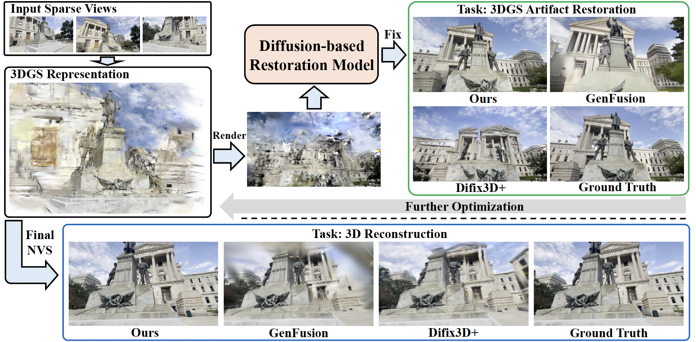
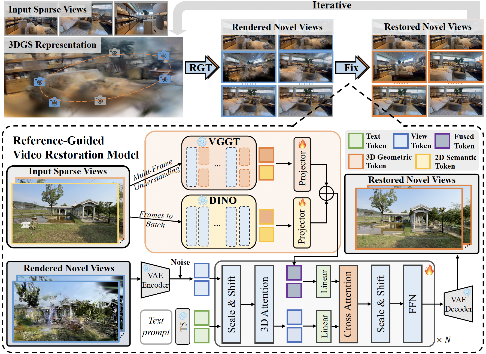

##GSFixer: Improving 3D Gaussian Splatting with Reference-Guided Video Diffusion Priors

 
 &nbsp;

## Introduction

We are currently cleaning up the code and awaiting company approval. The code, checkpoints, and data will be released as soon as possible.

TL;DR: using 2D semantic (DINOv2) and 3D geometric (VGGT) features of reference views (sparse input views) to guide video diffusion (CogVideoX) process, enabling semantic and 3D consistency in restorating artifact novel views.

Motivation: Recent approaches have sought to leverage generative priors to complete information for under-constrained regions, they struggle to generate content that remains consistent with input observation. To address this challenge, considering the artifacts finally lie in the 2D image space and are caused by suboptimal 3DGS representations in 3D space, we propose injecting both 2D semantic and 3D geometric control signals of reference views to guide the video diffusion process, enabling both semantic and 3D consistency in restorating the artifact novel views.

## Tesear

## Pipeline 

## Some Videos
<table style="width:100%; text-align:center;">
  <tr>
    <td><b>Artifact</b></td>
    <td><b>Difix3D+</b></td>
    <td><b>GenFusion</b></td>
    <td><b>GSFixer (Ours)</b></td>
    <td><b>GT</b></td>
  </tr>
  <tr>
    <td></td>
    <td></td>
    <td></td>
    <td></td>
    <td></td>
  </tr>
  <tr>
    <td></td>
    <td></td>
    <td></td>
    <td></td>
    <td></td>
  </tr>
  <tr>
    <td></td>
    <td></td>
    <td></td>
    <td></td>
    <td></td>
  </tr>
</table>

## Related Works
Including but not limited to: [CogVideoX](https://github.com/zai-org/CogVideo), [VGGT](https://github.com/facebookresearch/vggt), [DINOv2](https://github.com/facebookresearch/dinov2), [Difix3D+](https://github.com/nv-tlabs/Difix3D), [GenFusion](https://github.com/Inception3D/GenFusion), [3DGS-Enhancer](https://github.com/xiliu8006/3DGS-Enhancer), [ReconX](https://github.com/liuff19/ReconX), [ViewCrafter](https://github.com/Drexubery/ViewCrafter), [TrajectoryCrafter](https://github.com/TrajectoryCrafter/TrajectoryCrafter), [ReCamMaster](https://github.com/KwaiVGI/ReCamMaster)...

