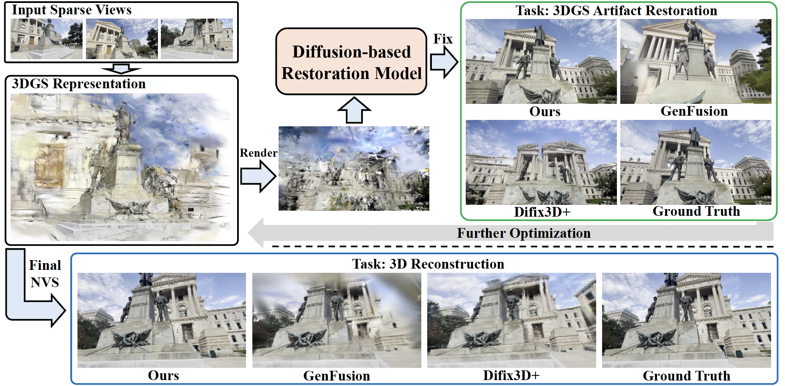
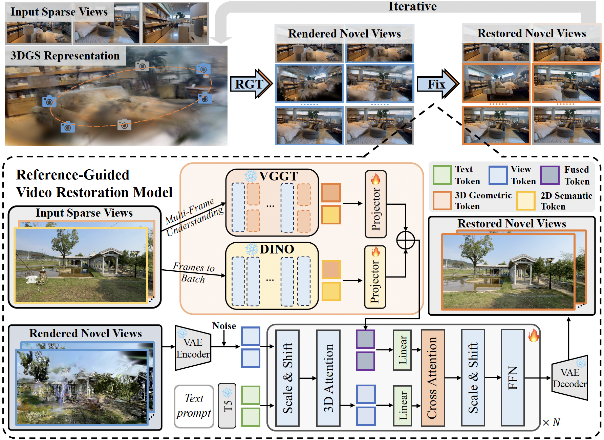

### GSFixer: Improving 3D Gaussian Splatting with Reference-Guided Video Diffusion Priors
[ArXiv](https://www.arxiv.org/abs/2508.09667) | [PDF](https://www.arxiv.org/pdf/2508.09667) | [Model (GSFixer_ckpt)](https://huggingface.co/flow666/GSFixer/tree/main) | [Bench (DL3DV-Res)](https://huggingface.co/datasets/flow666/DL3DV-Res_Benchmark/tree/main)

🤗 If you find GSFixer useful, **please help ⭐ this repo**, which is important to Open-Source projects. Thanks!

TL;DR: using 3D geometric (VGGT) and 2D semantic (DINOv2) features of reference views (sparse input views) to guide the video diffusion process, enabling consistency in restoring artifact novel views. 

Below shows some examples:

<table class="center">
    <tr style="font-weight: bolder;">
        <td>&emsp;&emsp;3DGS Artifact&emsp;&emsp;&emsp;&emsp;&emsp; Difix3D+&emsp;&emsp;&emsp;&emsp;&emsp; GenFusion&emsp;&emsp;&emsp;&emsp;&emsp;GSFixer (Ours)&emsp;&emsp;&emsp;&emsp;&emsp; GT</td>
    </tr>
  <tr>
  <td>
    
  </td>
  </tr>
  <tr>
  <td>
    
  </td>
  </tr>
  <tr>
  <td>
    
  </td>
  </tr>
</table>


## ⚙️ Setup

### 1. GSFixer
```bash
git clone https://github.com/GVCLab/GSFixer.git
cd GSFixer
```
### 2. Setup environments
GSFixer is tested with CUDA 12.1 on H20 & H100.
```bash
conda create -n gsfixer python=3.10
conda activate gsfixer
pip install torch torchvision --index-url https://download.pytorch.org/whl/cu121
pip install -r requirements.txt
pip install Reconstruction/submodules/simple-knn
pip install Reconstruction/submodules/diff-gaussian-rasterization
```

### 3. Download pretrained models
Download the pretrained models (e.g., GSFixer, CogVideoX-I2V, VGGT...) using HuggingFace.
```bash
sh download/download_hf.sh 
```

### 4. Download datasets
Download [Mip-NeRF 360](https://jonbarron.info/mipnerf360/) dataset from their project page.

Download [DL3DV-Benchmark](https://huggingface.co/datasets/DL3DV/DL3DV-Benchmark) dataset using their download script.

Download the [DL3DV-Res](https://huggingface.co/datasets/flow666/DL3DV-Res_Benchmark/tree/main) dataset using HuggingFace:
```bash
python download/download_data_hf.py
```

## 💫 Inference 
### 1. Inference Restoration Demo
```bash
cd Restoration
python inference_gs_restoration_demo.py \
--model_name PATH-to-CogVideoX-5b-I2V \
--transformer_path PATH-to-GSFixer \
--dinov2_ckpt PATH-to-dinov2-with-registers-large \
--vggt_ckpt PATH-to-vggt-model.pt \
--blip_path PATH-to-blip2-opt-2.7b \
--base_folder PATH-to-DL3DV_Res_benchmark \
--ref_folders PATH-to-DL3DV_benchmark \
--num_views 3 \
--images_root ./demo/032dee9fb0a8bc1b90871dc5fe950080d0bcd3caf166447f44e60ca50ac04ec7 \
--outpath ./output_gsfixer_inference_results \
--scene_name ./examples/gsfixer/DL3DV-Res_scene_names.txt
```

### 2. Generative Novel View Restoration
Run [evaluate.sh](./Restoration/examples/gsfixer/evaluate.sh). Please refer to the args to set up parameters.
```bash
cd Restoration
bash examples/gsfixer/evaluate.sh
```

### 3. Generative 3D Reconstruction
Run [train.py](./Reconstruction/train.py) using the following script. Please refer to the args to set up parameters.
```bash
cd Reconstruction
# for per-scene results
python train_mipnerf360_sparse_view_recon_per_scene.py

# for all results
python train_mipnerf360_sparse_view_recon_all_scene.py
```


<!-- ## Tesear


## Pipeline 
 -->


## 🤗 Related Works
Including but not limited to: [CogVideoX](https://github.com/zai-org/CogVideo), [diffusers](https://github.com/huggingface/diffusers), [VGGT](https://github.com/facebookresearch/vggt), [DINOv2](https://github.com/facebookresearch/dinov2), [Difix3D+](https://github.com/nv-tlabs/Difix3D), [GenFusion](https://github.com/Inception3D/GenFusion), [3DGS-Enhancer](https://github.com/xiliu8006/3DGS-Enhancer), [ReconX](https://github.com/liuff19/ReconX), [ViewCrafter](https://github.com/Drexubery/ViewCrafter), [TrajectoryCrafter](https://github.com/TrajectoryCrafter/TrajectoryCrafter), [ReCamMaster](https://github.com/KwaiVGI/ReCamMaster)...

## 📜 Citation
If you find the work useful, please consider citing:
```BibTeXw
@article{yin2025gsfixer,
  title={GSFixer: Improving 3D Gaussian Splatting with Reference-Guided Video Diffusion Priors},
  author={Yin, Xingyilang and Zhang, Qi and Chang, Jiahao and Feng, Ying and Fan, Qingnan and Yang, Xi and Pun, Chi-Man and Zhang, Huaqi and Cun, Xiaodong},
  journal={arXiv preprint arXiv:2508.09667},
  year={2025}
}
```
